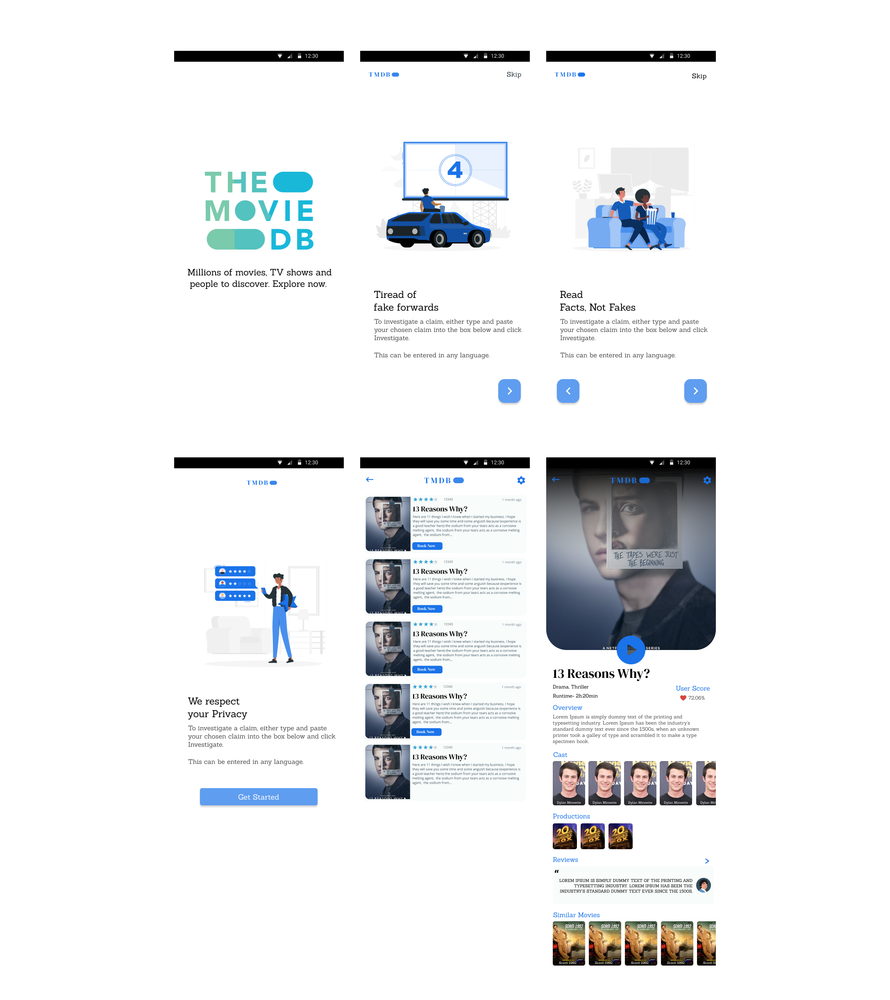

<!-- PROJECT LOGO -->
<br />
<p align="center">
  <a href="https://github.com/itsnitinsworld/MovieDB-Android/">
    
  </a>


  <h3 align="center">The Movie DB</h3>

  <p align="center">
    Millions of movies, TV shows and people to discover. Explore now.
    <br />
    <a href="https://github.com/othneildrew/Best-README-Template"><strong>Explore the docs »</strong></a>
    <br />
    <br />
    <a href="https://www.figma.com/file/yphEUcheCderJplkWjIh6C/Movie-DB?node-id=40%3A0">View Demo</a>
    ·
    <a href="https://github.com/itsnitinsworld/MovieDB-Android/issues">Download APK</a>
    ·
  </p>


</p>


<!-- TABLE OF CONTENTS -->

## Table of Contents

* [About the Project](#about-the-project)
  * [Built With](#built-with)
* [Getting Started](#getting-started)
  * [Installation](#installation)


<!-- ABOUT THE PROJECT -->
## About The Project



### Built With
Libraries and programming languages used in the project are-
* [Kotlin](https://kotlinlang.org/)
* [RxJava](https://github.com/ReactiveX/RxJava)
* [Retrofit](https://square.github.io/retrofit/)
* [Dagger](https://github.com/google/dagger)


<!-- GETTING STARTED -->


### Installation

1. Get a free API Key at [https://www.themoviedb.org/](https://www.themoviedb.org/)
2. Clone the repo
```sh
git clone https://github.com/itsnitinsworld/MovieDB-Android.git
```

3. Enter your API in `gradle.properties`
```sh
MOVIEDB_API_KEY = "4c065e562519ef8755b6f816a9b81e67" ;
```


